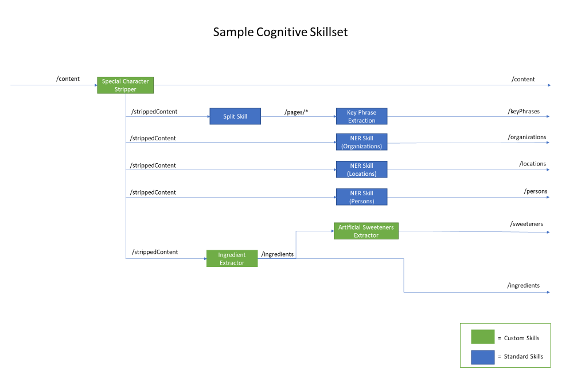

## Getting Started: Cognitive Search Template

### 1.0	Deploy Services

You can deploy your Azure Resources more easily using the pre-configured ARM template 
included with this documentation in the **. Modify the parameters file to 
configure the names of your resources (resource names should be lowercased). 
Then deploy using the **deploy** PowerShell script. 
Find more information on deploying ARM templates here: https://docs.microsoft.com/en-us/azure/azure-resource-manager/resource-group-template-deploy-portal.

If you get any errors when running your deployment you can use the following command to get detailed logs using the tracking id:

        Get-AzureRMLog -CorrelationId xxxxxxxx-xxxx-xxxx-xxxx-xxxxxxxxxxxx -DetailedOutput

### 2.0	Ingest Documents
To use Cognitive Search, you should first ingest your raw files into a storage location, 
such as Azure Blob Storage or Cosmos DB. Depending on your data structure, you may want 
to combine additional metadata with your extracted content to enable more advanced search 
scenarios. This can be achieved using a custom skill in your Cognitive Search pipeline 
and will be discussed further in later sections. 

For the purposes of this guide we will be using Azure Blob Storage as our primary storage location.

### 3.0 Design Skillset

### 4.0	Build Skills
#### 4.1 Build and train ML models 
Custom Skills in Cognitive Search allow for additional defining and processing of file data. 
There is no set definition of what these skills can do, but some examples include extracting 
unsupported entities or complex types, storing file content externally, or performing 
predictive analysis using a model. These custom skills can be chained together or with the
standard Cognitive Services skills, such as the Named Entity Recognition (NER) skills. As
mentioned before, additional processing of the file data might be required prior to using
the standard Cognitive Services skills, such as removing special characters for better 
accuracy and relevance.

These Custom Skills can be hosted on an Azure Function for easy API integration within the
Cognitive Search Pipeline.

In the diagram below you can see an example of a Cognitive Search skillset that uses 
both standard and Custom Skills. This example scenario highlights the use of Custom 
Skills that feed into the standard Cognitive Services skills. You can imagine that 
this scenario is for a food company that wants to search through their documents 
for specific entities, such as ingredients or its facilities in various locations. 

#### 4.2 Build Azure Functions
Azure Functions are a simple way to deploy custom skills and can be integrated with your 
Cognitive Search pipeline using the WebApiSkill.

### 5.0 Create Pipeline
#### 5.1 Define Data Source
Create data source (Azure Search REST API) 

    PUT /datasources/{{data-source}}?api-version=2017-11-11-preview HTTP/1.1
    Host: {{search-service}}.search.windows.net
    api-key: {{search-api-key}}
    Content-Type: application/json
    Body: Azure Search/01_create_data_source.json
#### 5.2 Define Index
Define your index fields (Read more)
Create Search Index (Azure Search REST API)

    PUT /indexes/{{search-index}}?api-version=2017-11-11-preview HTTP/1.1
    Host: {{search-service}}.search.windows.net
    api-key: {{search-api-key}}
    Content-Type: application/json
    Body: Azure Search/02_create_index.json
#### 5.3 Define Skillset
Define Cognitive Skillset (Read more)
Create Cognitive Skillset (Azure Search REST API) 

    PUT /skillsets/{{search-chained-skillset}}?api-version=2017-11-11-preview HTTP/1.1
    Host: {{search-service}}.search.windows.net
    api-key: {{search-api-key}}
    Content-Type: application/json
    Body: Azure Search/03_create_skillset.json?
#### 5.4 Define Indexer
Define Search Indexer (Read more)
Create and Run Indexer (Azure Search REST API)

    PUT /indexers/{{search-indexer}}?api-version=2017-11-11-preview HTTP/1.1
    Host: {{search-service}}.search.windows.net
    api-key: {{search-api-key}}
    Content-Type: application/json
    Body: Azure Search/04_create_indexer.json 
#### 5.5 Verify Index Content
Verify index content (Azure Search REST API) 

    GET /indexes/{{search-index}}/docs?search=*&amp;api-version=2017-11-11-Preview HTTP/1.1Host: {{search-service}}.search.windows.net
    api-key: {{search-api-key}}
    Content-Type: application/json
    Body: Azure Search/05_sample_index_search.json

### 6.0 Deploy Search UI

#### 6.1 Update appsettings.json

Update the following fields in appsettings.json.

#### 6.2 Update SearchModel.cs

Update the following fields in Search\SearchModel.cs. 

**Facets** - Defines which facetable fields will show up as selectable filters in the UI. By default includes all facetable fields.

**Tags** - Defines which fields will be added to the Results card and details view as buttons. By default includes all facetable fields.

**ResultFields** - Defines which fields will be returned in the results view. Only fields that are used for the UI should be included here to reduce latency caused by larger documents. By default includes all fields.

### Additional Resources
- [What is Cognitive Search?](https://docs.microsoft.com/en-us/azure/search/cognitive-search-concept-intro)
- [Cognitive Search Quickstart](https://docs.microsoft.com/en-us/azure/search/cognitive-search-quickstart-blob)
- [Cognitive Search REST APIs](https://docs.microsoft.com/en-us/azure/search/cognitive-search-tutorial-blob)
- [Azure ML](https://azure.microsoft.com/en-us/services/machine-learning-services/)